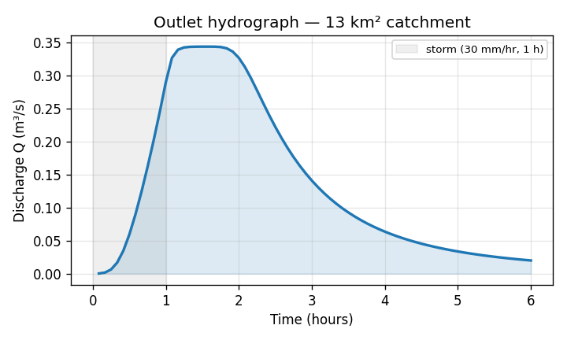

# Examples

Every example below is runnable and produces the figure shown.

## 1. Delineate a watershed from a DEM

Run just the `process_dem` stage to reproject, pit-fill, compute D8 flow
direction/accumulation, and delineate the catchment draining to your outlet.

```python
from hydroflow import Config, run_pipeline

cfg = Config(
    DEM_PATH="dem_250.tif",
    OUTPUT_DIR="results/",
    OUTPUT_POINT=(27.632222, 85.293333),   # (lat, lon)
    TARGET_CRS_EPSG="EPSG:32645",
)
cfg.update_output_paths()

out = run_pipeline(cfg, stages=("process_dem",))
print(out["watershed_geojson"])   # results/watershed.geojson
```

Plot the clipped DEM with the delineated boundary:

```python
import rasterio, geopandas as gpd
from rasterio.plot import plotting_extent
import matplotlib.pyplot as plt

with rasterio.open("results/clipped_dem.tif") as src:
    dem, ext = src.read(1), plotting_extent(src)

ax = plt.subplot()
ax.imshow(dem, extent=ext, cmap="terrain")
gpd.read_file("results/watershed.geojson").boundary.plot(ax=ax, color="crimson")
plt.show()
```


## 2. Route a storm into a hydrograph

Add the `routing` stage. Here a 1-hour, 30 mm/hr design storm is routed as
runoff across a compact catchment with the kinematic-wave scheme.

```python
from hydroflow import Config, run_pipeline
import pandas as pd, matplotlib.pyplot as plt

cfg = Config(
    DEM_PATH="catchment.tif",
    OUTPUT_DIR="results/",
    OUTPUT_POINT=(27.23, 85.30),
    TARGET_CRS_EPSG="EPSG:32645",
    PRECIP_METHOD="uniform",
    RAIN_INTENSITY_MM_HR=30.0,
    RAIN_DURATION_HOURS=1.0,
    TOTAL_SIMULATION_TIME_HOURS=6.0,
    RUNOFF_SOURCE="none",            # route rainfall directly
    ROUTING_SCHEME="kinematic",
    TIME_STEP_SECONDS=1.0,
    OUTPUT_INTERVAL_SECONDS=300,
)
cfg.update_output_paths()
run_pipeline(cfg, stages=("process_dem", "routing"))

hg = pd.read_csv("results/hydrograph.csv")
plt.plot(hg["time_hr"], hg["Q_m3s"])
plt.xlabel("Time (hours)"); plt.ylabel("Discharge Q (m³/s)")
plt.show()
```



The rising limb builds while it rains, the peak arrives just after the storm
ends, and the recession follows as the basin drains. Every run also prints a
mass-balance report so you can trust the numbers:

```
Closure error : -0.000 m³  (-7.5e-12 % of input)  [PASS]
```

## 3. Switch routing schemes (strings or integer codes)

Options accept a string **or** an integer code, so a sweep is a one-liner:

```python
for scheme in ["kinematic", "diffusive", "muskingum"]:   # or 0, 1, 2
    cfg = Config(DEM_PATH="catchment.tif", OUTPUT_DIR=f"out_{scheme}/",
                 OUTPUT_POINT=(27.23, 85.30), ROUTING_SCHEME=scheme,
                 PRECIP_METHOD=0, RUNOFF_SOURCE=0)   # 0 == "uniform" / "none"
    cfg.update_output_paths()
    run_pipeline(cfg, stages=("process_dem", "routing"))
```

## 4. Physically-based runoff (VSA-OPM)

Switch `RUNOFF_SOURCE` to the full VSA-OPM sandbox and compose mechanisms —
saturation-excess (VSA), Green-Ampt infiltration (Horton), and impervious
shedding:

```python
cfg = Config(
    DEM_PATH="dem.tif", OUTPUT_DIR="results/",
    OUTPUT_POINT=(27.63, 85.29),
    RUNOFF_SOURCE="vsa_opm",                 # or 4
    RUNOFF_MECHANISMS=["vsa", "horton", "impervious"],
    OPM_SD_MAX_INITIAL=0.10,                 # root-zone depth (m)
    OPM_PHI=0.35, OPM_K_SAT=44.0,
    OPM_INFILTRATION="green_ampt",
    ROUTING_SCHEME="diffusive",
)
cfg.update_output_paths()
run_pipeline(cfg, stages=("process_dem", "routing"))
```

Add satellite forcing by setting `PRECIP_METHOD="imerg_idw"`,
`OPM_SD_SOURCE="gee"`, and a `GEE_PROJECT` — see [Configuration](configuration.md).
