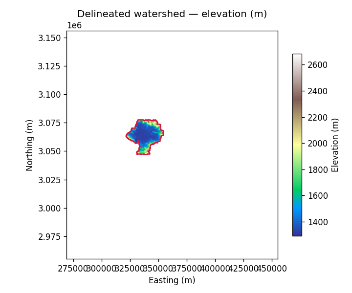
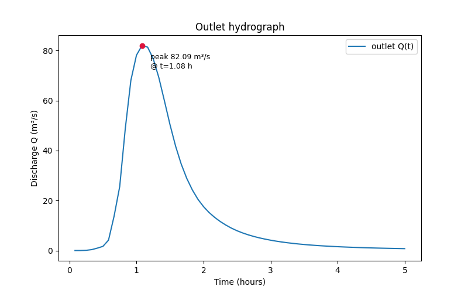

# hydroflow

**A distributed, physics-based hydrological + hydrodynamic model.**

hydroflow turns a bare-earth DEM and a rain event into a routed flood
hydrograph. It implements Variable Source Area (VSA) saturation-excess runoff,
Green-Ampt infiltration and impervious urban shedding (the Pradhan & Ogden 2010
"One-Parameter Model"), feeding an explicit grid-based
kinematic / diffusive-wave / Muskingum–Cunge channel router — all in pure
NumPy/SciPy/rasterio, with optional GPU acceleration and Google Earth Engine
forcing.

<div class="grid" markdown>

{ loading=lazy }

{ loading=lazy }

</div>

```bash
pip install hydroflow
```

```python
from hydroflow import Config, run_pipeline

cfg = Config(DEM_PATH="dem.tif", OUTPUT_DIR="results/")
cfg.update_output_paths()
run_pipeline(cfg, stages=("process_dem", "routing"))   # → results/hydrograph.csv
```

[Get started](quickstart.md){ .md-button .md-button--primary }
[See examples](examples.md){ .md-button }

## What hydroflow offers

<div class="grid cards" markdown>

-   :material-map-marker-path:{ .lg .middle } __DEM → watershed__

    ---

    Reproject, pit-fill, D8 flow direction/accumulation and watershed
    delineation from a single DEM. Two engines (`pysheds`, `pyflwdir` for large
    flat reservoirs).

-   :material-weather-pouring:{ .lg .middle } __Runoff generation__

    ---

    `none · coefficient · raster · scs_cn · vsa_opm`. VSA saturation-excess +
    Green-Ampt infiltration + impervious shedding as composable mechanisms.

-   :material-waves:{ .lg .middle } __Flood routing__

    ---

    Explicit grid solver: kinematic wave, diffusive wave, or
    Muskingum–Cunge — with always-on mass-balance checking.

-   :material-satellite-variant:{ .lg .middle } __Satellite forcing__

    ---

    Optional Google Earth Engine inputs: IMERG rainfall, SERVES soil-moisture
    deficit, SoilGrids texture, LULC/LCZ. Everything degrades gracefully offline.

-   :material-chip:{ .lg .middle } __CPU / GPU__

    ---

    One code path, NumPy or CuPy. Request `BACKEND="gpu"` and it falls back to
    CPU automatically if no GPU is present.

-   :material-console:{ .lg .middle } __Three interfaces__

    ---

    A Python API, a config-file `hydroflow` CLI, and a QGIS plugin — all driven
    by one `Config` object.

</div>

## How it fits together

```
DEM ──▶ process_dem ──▶ watershed + flow grid
                              │
        rainfall ──▶ runoff generation ──▶ effective runoff
                              │
                              ▼
                      routing (time loop) ──▶ hydrograph.csv + mass balance
```

Every run is driven by a single [`Config`](configuration.md) object through
`run_pipeline`, whether you call it from Python, the CLI, or the QGIS plugin.

## Learn the science

A free, interactive companion textbook walks through the physics from the ground
up (DEMs, delineation, runoff, and each routing scheme) with in-browser
simulations:
[**the hydroflow course**](https://sauravbhattarai19.github.io/hydroflow/).
